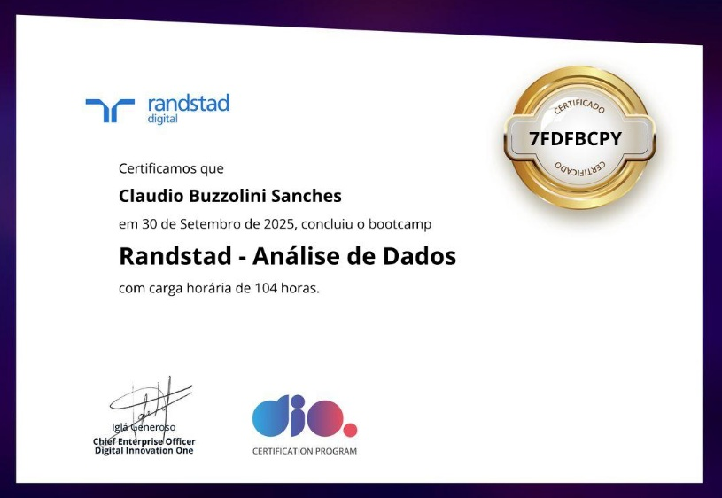

# Repositório de Projetos - Bootcamp DIO - Randstad Análise de Dados

Este repositório reúne um indice sobre os projetos desenvolvidos durante **Bootcamp DIO - Randstad Analise da Dados** da Digital Innovation One (DIO), onde foi abordando:

Certificado de conclusão:

# Atividades:
### Introdução a Versionamento com Git & GitHub - Elidiana Andrade
### Seus Primeiros passos com IA - Valéria Baptista
### Machine Learning com Azure - Felipe Kenji Chikuji
### Introdução a Banco de Dados Relacionais - Juliana Mascarenhas
### Sistemas Relacionais em Banco de Dados Relacionais - Juliana Mascarenhas
### Trabalhando em Consultas - Juliana Mascarenhas
### Análise de Dados com Excel e Copilot - Felipão DIO
### Fundamento de BI - Juliana Mascarenhas
### Visualização de Dados e Relatórios com Power BI - Juliana Mascarenhas
### Processamento de Dados com Power BI

# Mentorias:
### Introdução Prática ao Tbleau - Visualização e Transformação de DAdos - Matheus Cedro  - Randstad
### Desvendando os Modelos de Decisão: O caminho paa Decision Intelligence - Matheus Cedro - Randstad
### Transformando Dados em Insights com Linguagem Natual - Matheus Cedro e Vanessa Theodoro Bacelar
### Papo com RH: O novo Perfil de Profissional de Dados com IA que o Mercado Procura - Raíza Santos e Fernanda Lima

## Projetos e Links dos laboratórios que realizei laboratórios:

- [Projeto Open Source DIO](https://github.com/Claudio-Sanches/dio-lab-open-source/blob/main/community/Claudio-Sanches)
- [Laboratório DIO - Análise de Sentimentos](https://github.com/Claudio-Sanches/Laboratorio-DIO-Analise-de-Sentimentos.git)
- [Modelagem de Banco de Dados E-Commerce](https://github.com/Claudio-Sanches/ecommerce.git)
- [Modelo de Banco de Dados Oficina Mecânica](https://github.com/Claudio-Sanches/Oficina.git)
- [Projeto Lógico E-Commerce](https://github.com/Claudio-Sanches/Projeto-L-gico.git)
- [Projeto Lógio Oficina mecânica](https://github.com/Claudio-Sanches/Projeto-logico-oficina.git)
- [Dashboard de Vendas Xbox com Excel](https://github.com/Claudio-Sanches/Dashboard-excel.git)
- [Dashboar de Vendas em Power BI](https://github.com/Claudio-Sanches/Dashboard-Vendas.git)
- [Relatório Gerencial de Vendas](https://github.com/Claudio-Sanches/Relatorio_Gerencial.git)
- [Dashboar corporativo com integração MySQL e Azure](https://github.com/Claudio-Sanches/Integra_MySQL_Azure.git)

---

## Resumo dos Links e Explicações

---

### Projeto Open Source DIO
Guia prático para quem deseja contribuir com projetos open source no GitHub. O arquivo traz:
- Instruções para fork, clone, commit e pull request
- Exemplos de README para perfis
- Utilitários para badges, cards e links
- Dicas para engajamento e boas práticas
Ideal para iniciantes que querem participar da comunidade open source e aprender sobre colaboração em projetos públicos.
Instrutor(a): Elidiana Andrade a quem agradeço.

---

### Laboratório DIO - Análise dos Sentimentos
Laboratórios de análise de texto e fala baseados em inteligência artificial, utilizando recursos da Microsoft Learn AI Fundamentals. O projeto inclui:
- Scripts Python para visualização de sentimentos
- Arquivos JSON com resultados de APIs de análise de texto e transcrição de fala
- Imagens ilustrativas dos experimentos
- Instruções para execução e instalação de dependências
Permite explorar técnicas de processamento de linguagem natural e análise de sentimentos em avaliações e transcrições.
Intrutor(a): Valéria Baptista a quem agradeço

---

### Modelagem de Banco de Dados E-Commerce
Projeto de modelagem de banco de dados para um sistema de e-commerce. Inclui:
- **Diagrama conceitual**: Entidades como Cliente, Pedido, Produto, Fornecedor, Estoque, Pagamento, entre outras, e seus relacionamentos.
- **Script SQL**: Criação das tabelas, chaves primárias e estrangeiras no MySQL.
- **Modelagem física**: Arquivo para edição no MySQL Workbench.
O objetivo é fornecer uma estrutura robusta para cadastro, vendas, controle de estoque, pagamentos e entregas.
Instrutor(a): Juliana Mascarenhas a quem agradeço

---

### Modelo de Banco de Dados Oficina Mecânica
Modelo relacional para gerenciamento de ordens de serviço em oficina mecânica. O sistema contempla:
- Cadastro de clientes e veículos
- Gestão de equipes e mecânicos
- Registro de ordens de serviço, serviços realizados e peças utilizadas
- Cálculo de valores e status das ordens
Inclui scripts SQL, documentação DBML e diagramas visuais para facilitar a implementação e manutenção do banco de dados.
Intrutor(a): Juliana Mascarenhas a quem agradeço

---

### Projeto lógico E-Commerce
Modelo Lógico de banco de dados baseado na Modelagem conceitual desenvolvida para sistema E-Commerce em atividade anterior. Arquivos criados:

- criar_db.sql - Cria as tabelas do banco de dados
- popular-db.sql - Pupula as tabelas
- recuperar1-db.sql - Recupera as informações conforme solicitado na atividade

Utilizei MySQL, MySQL Workbench, SQL e VSCode + Copilot.
Intrutor(a): Juliana Mascarenhas a quem agradeço

---

### Projeto Lógico Oficina mecânica
Modelo Lógico de banco de dados baseado na Modelagem conceitual desenvolvida para sistema de Oficina Mecânica em atividade anterior. Arquivos criados:

- criar_db.sql - Cria as tabelas do banco de dados
- popular-db.sql - Pupula as tabelas
- recuperar1-db.sql - Recupera as informações conforme solicitado na atividade
- crud_ordem_servico.py

CRUD de ordens de serviço em Python, com instruções para instalação de dependências e uso de um menu interativo no terminal.
Intrutor(a): Juliana Mascarenhas a quem agradeço

---

### Dashboard de Vendas Xbox com Excel
Projeto de dashboard em Excel para análise de vendas do Xbox Game Pass. O arquivo contém as seguintes pastas:
- **Bases**: Base de dados detalha dos assinantes, como nome, plano, data de início, renovação automática, descontos e valores pagos.
- **Dashboard Year**: Indicadores anuais, número de assinaturas, valores vendidos, participação em passes de temporada (EA Play, Minecraft) e renovação automática.
- **Dashboard Month**: Gráficos mensais de vendas por plano, período de assinatura e produto, permitindo análise detalhada do desempenho ao longo do tempo.
Instrutor(a): Felipão DIO a quem agradeço

---

### Dashboard de Vendas em Power BI
Este projeto consiste na criação de um Dashboard de vendas utilizando uma amostra de dados financeiros. O desafio inclui a replicação de páginas já desenvolvidas durante o curso e a criação de uma terceira página com visuais específicos no Power BI:
- Mapa com soma de vendas e unidades vendidas por pais
- Mapa com soma do lucro por pais
- Gráfico de pizza com lucro por segmento

O relatorio deve ser organizado, com nomes claros nos visuais, uso de dicas de ferramentas relevantes e publicação do resultado. O projeto deve ser compartilhado como suplemento no PowerPoint ou salvo diretamento no Power BI.

Os arquivos principais são:
- Dashboar Vendas.pdf: visualização dos indicadores e gráficos de vendas
- Financial Sample.xlsx: base de dados para análise
Intrutor(a): Juliana Mascarenhas a quem agradeço

---

### Relatório Gerencial de Vendas
Este projeto foi desenvolvido como parte do desafio proposto pela DIO, utilizando a base de dados "Financial Sample" e recursos avançados do Power BI para criar um relatório gerencial interativo e completo. Foram aplicados conceitos de navegação, segmentação, visualização de dados e publicação no Power BI Service, seguindo as melhores práticas recomendadas.
Instrutor(a): Juliana Mascarenhas a quem agradeço

---

### Dashboar corporativo com integração MySQL e Azure

🎯 **OBJETIVO DO PROJETO** Integrar Dados com MySQL Azure e Transformando com Power BI

Ementa - Etapas do Desafio
1.	Descrevendo o desafio de projeto
2.	Criando uma instância do MySQL na Azure
3.	Explorando o Recurso - Instância do MySQL
4.	Se conectando ao Banco de Dados com Cloud Shell – corte: manter início-9:06
5.	Criando Regra no Firewall na Azure para Acesso ao banco de dados
6.	Conectando ao MySQL na Azure utilizando Workbench
7.	Integrando Power BI com MySQL na Azure

Descrição do desafio de projeto
1.	Criação de uma instância na Azure para MySQL
2.	Criar o Banco de dados com base disponível no github
3.	Integração do Power BI com MySQL no Azure 
4.	Verificar problemas na base a fim de realizar a transformação dos dados

Durante o desenvolvimento do desafio, tive limitação na conta Free Azure, impossibilitando criar banco MySQL, mas alternativamente a criação SQL estava disponível e a utilizei.

Utilizei o Visal Studio Code + Copilot para me auxiliar com as traduções necessárias entre MySQL e SQL e me surpreendi com o resultado, mas não tive problemas na transformação dos dados no Power BI, pois foram solucionadas em sua criação e através de Views completei o desafio proposto.

Estou entregando: 

Desenvolver um sistema completo de banco de dados **Company** no **Azure SQL Server** com integração ao **Power BI**, seguindo **arquitetura modular Python** e atendendo **8 demandas específicas** de transformação de dados.

### **🎯 CONQUISTAS:**

1. **🏗️ Arquitetura modular** implementada com sucesso
2. **📊 Todas as 8 demandas Power BI** atendidas
3. **🌐 Infraestrutura Azure** configurada e documentada
4. **🚀 Sistema automatizado** 100% funcional
5. **📚 Documentação completa** para replicação

**O projeto está pronto para produção e serve como referência para futuros desenvolvimentos empresariais!** 🚀📊✨

Instrutor(a): Juliana Mascarenhas a quem agradeço

---
> by CBS construido no VSCode com auxílio do Copilot
---

# Project Repository - DIO Bootcamp - Randstad Data Analysis (english Version)

This repository gathers an index of the projects developed during the **DIO Bootcamp - Randstad Data Analysis** from Digital Innovation One (DIO), where the following topics were covered:

# Activities:
### Introduction to Version Control with Git & GitHub - Elidiana Andrade
### Your First Steps with AI - Valéria Baptista
### Machine Learning with Azure - Felipe Kenji Chikuji
### Introduction to Relational Databases - Juliana Mascarenhas
### Relational Systems in Relational Databases - Juliana Mascarenhas
### Working with Queries - Juliana Mascarenhas
### Data Analysis with Excel and Copilot - Felipão DIO
### BI Fundamentals - Juliana Mascarenhas
### Data Visualization and Reports with Power BI - Juliana Mascarenhas
### Data Processing with Power BI

# Mentoring Sessions:
### Practical Introduction to Tableau - Data Visualization and Transformation - Matheus Cedro - Randstad
### Unveiling Decision Models: The Path to Decision Intelligence - Matheus Cedro - Randstad
### Transforming Data into Insights with Natural Language - Matheus Cedro and Vanessa Theodoro Bacelar
### HR Talk: The New Data Professional Profile with AI that the Market is Looking For - Raíza Santos and Fernanda Lima

## Projects and Links to the laboratories I completed:

- [DIO Open Source Project](https://github.com/Claudio-Sanches/dio-lab-open-source/blob/main/community/Claudio-Sanches)
- [DIO Laboratory - Sentiment Analysis](https://github.com/Claudio-Sanches/Laboratorio-DIO-Analise-de-Sentimentos.git)
- [E-Commerce Database Modeling](https://github.com/Claudio-Sanches/ecommerce.git)
- [Mechanical Workshop Database Model](https://github.com/Claudio-Sanches/Oficina.git)
- [E-Commerce Logical Project](https://github.com/Claudio-Sanches/Projeto-L-gico.git)
- [Mechanical Workshop Logical Project](https://github.com/Claudio-Sanches/Projeto-logico-oficina.git)
- [Xbox Sales Dashboard with Excel](https://github.com/Claudio-Sanches/Dashboard-excel.git)
- [Sales Dashboard in Power BI](https://github.com/Claudio-Sanches/Dashboard-Vendas.git)
- [Management Sales Report](https://github.com/Claudio-Sanches/Relatorio_Gerencial.git)
- [Corporate Dashboard with MySQL and Azure Integration](https://github.com/Claudio-Sanches/Integra_MySQL_Azure.git)

---

## Summary of Links and Explanations

---

### DIO Open Source Project
Practical guide for those who want to contribute to open source projects on GitHub. The file includes:
- Instructions for fork, clone, commit and pull request
- README examples for profiles
- Utilities for badges, cards and links
- Tips for engagement and best practices
Ideal for beginners who want to participate in the open source community and learn about collaboration in public projects.
Instructor: Elidiana Andrade, to whom I am grateful.

---

### DIO Laboratory - Sentiment Analysis
Text and speech analysis laboratories based on artificial intelligence, using Microsoft Learn AI Fundamentals resources. The project includes:
- Python scripts for sentiment visualization
- JSON files with results from text analysis and speech transcription APIs
- Illustrative images of the experiments
- Instructions for execution and dependency installation
Allows exploration of natural language processing techniques and sentiment analysis in reviews and transcriptions.
Instructor: Valéria Baptista, to whom I am grateful

---

### E-Commerce Database Modeling
Database modeling project for an e-commerce system. Includes:
- **Conceptual diagram**: Entities such as Customer, Order, Product, Supplier, Stock, Payment, among others, and their relationships.
- **SQL script**: Creation of tables, primary and foreign keys in MySQL.
- **Physical modeling**: File for editing in MySQL Workbench.
The objective is to provide a robust structure for registration, sales, inventory control, payments and deliveries.
Instructor: Juliana Mascarenhas, to whom I am grateful

---

### Mechanical Workshop Database Model
Relational model for managing service orders in a mechanical workshop. The system includes:
- Customer and vehicle registration
- Team and mechanic management
- Registration of service orders, performed services and parts used
- Calculation of values and order status
Includes SQL scripts, DBML documentation and visual diagrams to facilitate database implementation and maintenance.
Instructor: Juliana Mascarenhas, to whom I am grateful

---

### E-Commerce Logical Project
Logical database model based on the conceptual modeling developed for the E-Commerce system in a previous activity. Created files:

- criar_db.sql - Creates the database tables
- popular-db.sql - Populates the tables
- recuperar1-db.sql - Retrieves information as requested in the activity

I used MySQL, MySQL Workbench, SQL and VSCode + Copilot.
Instructor: Juliana Mascarenhas, to whom I am grateful

---

### Mechanical Workshop Logical Project
Logical database model based on the conceptual modeling developed for the Mechanical Workshop system in a previous activity. Created files:

- criar_db.sql - Creates the database tables
- popular-db.sql - Populates the tables
- recuperar1-db.sql - Retrieves information as requested in the activity
- crud_ordem_servico.py

Service order CRUD in Python, with instructions for dependency installation and use of an interactive menu in the terminal.
Instructor: Juliana Mascarenhas, to whom I am grateful

---

### Xbox Sales Dashboard with Excel
Excel dashboard project for Xbox Game Pass sales analysis. The file contains the following sheets:
- **Bases**: Detailed subscriber database, including name, plan, start date, auto-renewal, discounts and amounts paid.
- **Dashboard Year**: Annual indicators, number of subscriptions, sales values, participation in season passes (EA Play, Minecraft) and auto-renewal.
- **Dashboard Month**: Monthly sales charts by plan, subscription period and product, allowing detailed performance analysis over time.
Instructor: Felipão DIO, to whom I am grateful

---

### Sales Dashboard in Power BI
This project consists of creating a sales dashboard using a sample of financial data. The challenge includes replicating pages already developed during the course and creating a third page with specific visuals in Power BI:
- Map with sum of sales and units sold by country
- Map with sum of profit by country
- Pie chart with profit by segment

The report must be organized, with clear names in the visuals, use of relevant tooltips and publication of the result. The project should be shared as a supplement in PowerPoint or saved directly in Power BI.

The main files are:
- Dashboard Vendas.pdf: visualization of sales indicators and charts
- Financial Sample.xlsx: database for analysis
Instructor: Juliana Mascarenhas, to whom I am grateful

---

### Management Sales Report
This project was developed as part of the challenge proposed by DIO, using the "Financial Sample" database and advanced Power BI features to create an interactive and complete management report. Navigation, segmentation, data visualization and publication concepts were applied in Power BI Service, following recommended best practices.
Instructor: Juliana Mascarenhas, to whom I am grateful

---

### Corporate Dashboard with MySQL and Azure Integration

🎯 **PROJECT OBJECTIVE** Integrate Data with MySQL Azure and Transform with Power BI

Syllabus - Challenge Steps
1. Describing the project challenge
2. Creating a MySQL instance in Azure
3. Exploring the Resource - MySQL Instance
4. Connecting to the Database with Cloud Shell – cut: maintain beginning-9:06
5. Creating Firewall Rule in Azure for Database Access
6. Connecting to MySQL in Azure using Workbench
7. Integrating Power BI with MySQL in Azure

Project challenge description
1. Creating an Azure instance for MySQL
2. Create the database based on the available base on github
3. Power BI integration with MySQL in Azure
4. Check problems in the base in order to perform data transformation

During the development of the challenge, I had limitations in the free Azure account, making it impossible to create a MySQL database, but alternatively SQL creation was available and I used it.

I used Visual Studio Code + Copilot to help me with the necessary translations between MySQL and SQL and I was surprised by the result, but I had no problems in transforming the data in Power BI, as they were solved in its creation and through Views I completed the proposed challenge.

I am delivering:

Develop a complete **Company** database system in **Azure SQL Server** with **Power BI** integration, following **modular Python architecture** and meeting **8 specific demands** for data transformation.

### **🎯 ACHIEVEMENTS:**

1. **🏗️ Modular architecture** successfully implemented
2. **📊 All 8 Power BI demands** met
3. **🌐 Azure infrastructure** configured and documented
4. **🚀 Automated system** 100% functional
5. **📚 Complete documentation** for replication

**The project is ready for production and serves as a reference for future business developments!** 🚀📊✨

Instructor: Juliana Mascarenhas, to whom I am grateful

---
> by CBS built in VSCode with the help of Copilot
---
